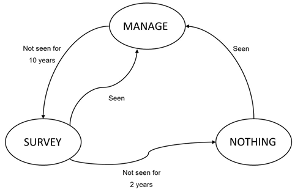
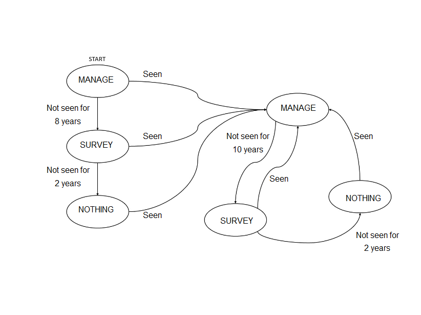
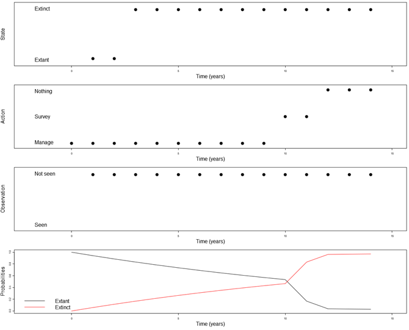
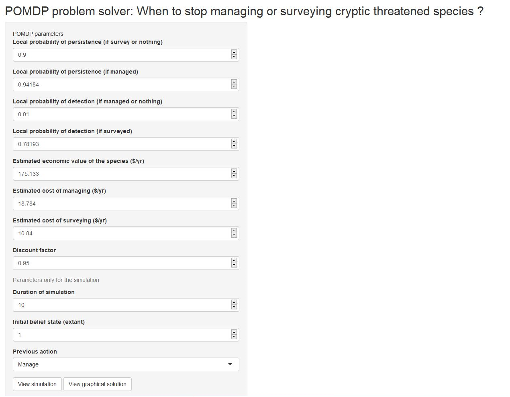

# smsPOMDP
R package : solving POMDP problem When to stop managing or surveying cryptic threatened species ?

``` r
#smsPOMDP requires the previous intall of the package 'sarsop', available on github
list.of.packages <- c("sarsop")
new.packages <- list.of.packages[!(list.of.packages %in% utils::installed.packages()[,"Package"])]
if(length(new.packages)>0) {
  devtools::install_github("boettiger-lab/sarsop", host = "https://api.github.com")
}

devtools::install_github("lvpascal/smsPOMDP", host = "https://api.github.com")
library(smsPOMDP)
```

## Problem definition

Our problem is defined by a state space, `states`, representing the 
current state of the species (extant and extinct), an action space, `actions`
representing the lead action (manage, survey and nothing), and an observation 
space, `observations`, representing the observation of the species (seen and not seen)

To solve the POMDP problem of: When to stop managing or surveying cryptic threatened species ?

## Sumatran tiger example
### Parameters
We need to fix the POMDP parameters
``` r
pen = 0.1 #local probability of extinction P(extinct/extant, survey or nothing)
p0 = 1-pen #local probability of persitance P(extant/extant, manage)
pem = 0.05816 #local probability of extinction if managed P(extinct/extant, manage)
pm = 1 - pem #local probability of persistance if managed P(extant/extant, manage)
d0 = 0.01 #local probability of detection P(present/extant, manage or nothing)
d = 0.78193 #local probability of detection if surveyed P(present/extant, survey)
V = 175.133 #Estimated economic value of the species ($/yr)
Cm = 18.784 #Estimated cost of managing ($/yr)
Cs = 10.840 #Estimated cost of surveying ($/yr)
```
### Buildind transition, observation and reward matrices calling smsPOMDP functions
The smsPOMDP package provides a set of functions which compute transition, observation and reward matrices
``` r
#transition, observation and reward matrices
Tr = tr(p0, pm, d0, d, V, Cm, Cs)
Ob = obs(p0, pm, d0, d, V, Cm, Cs)
Re = rew(p0, pm, d0, d, V, Cm, Cs)
```
### Resolution of POMDP
You only need to call the 'graph' function, which will provide a decisions diagram
``` r
state_prior = c(1,0) #extant : 1, extinct : 0
graph(p0, pm, d0, d, V, Cm, Cs, state_prior)
```
<!-- -->

``` r
state_prior = c(0.9,0.1) #extant : 0.9, extinct : 0.1
graph(p0, pm, d0, d, V, Cm, Cs, state_prior)
```
<!-- -->
### Simulation
A few more parameters to set and call the 'sim' function
``` r
#Initial belief state
state_prior = c(0.9,0.1) #extant : 0.9, extinct : 0.1

#Horizon of the simulation
Tmax = 20

sim(p0, pm, d0, d, V, Cm, Cs, state_prior, Tmax)
```
<!-- -->
### Running the app
This package provides a function which lanches an app, which eases the resolution of the problem for the users.
``` r
run_application()
```
<!-- -->
